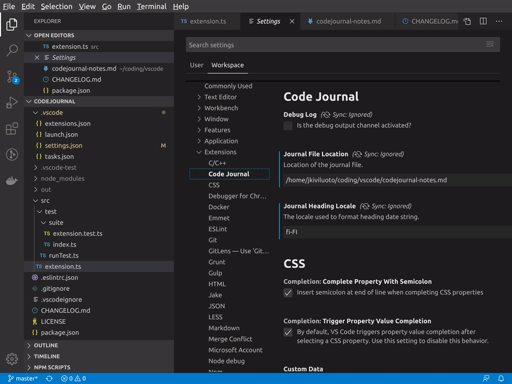

# Code Journal

A simple linear single-file journal to support software development.

## Features

Creates a new top-level heading for every day, with localized date string. Keeps other markdown headings intact.

## Extension Settings

This extension contributes the following settings:

* `codejournal.journalFileLocation`: Journal file location
* `codejournal.journalHeadingLocale`: Javascript locale to use for heading date string, defaults to en-US
* `codejournal.debugLog`: Open an output channel for debug log

## Known Issues

* Only top-level headings supported.

## References

The icon used is by Harwen. It is free to use for non-commercial use. Source: [IconArchive](http://www.iconarchive.com/show/pleasant-icons-by-harwen/Default-Icon-icon.html)